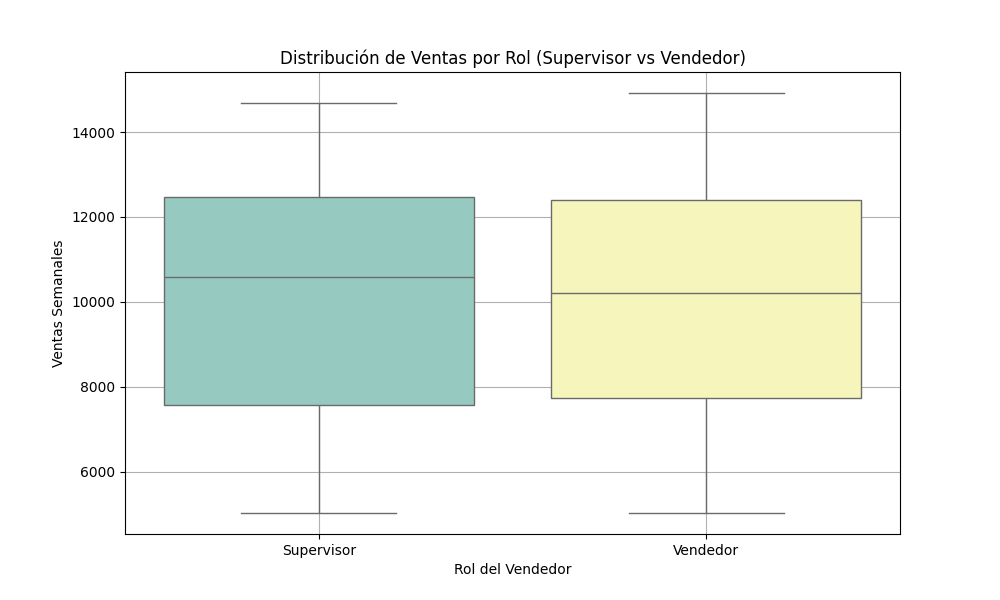
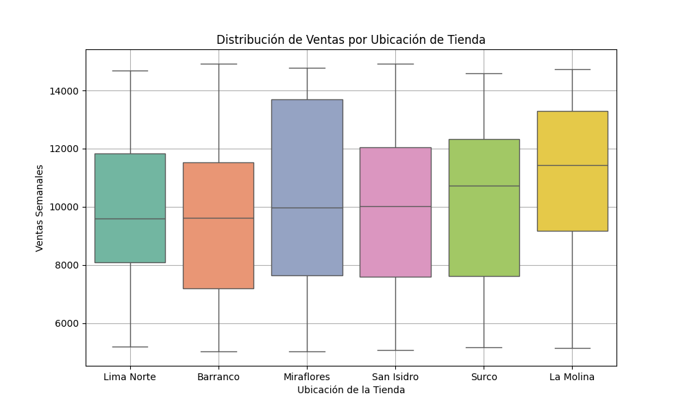
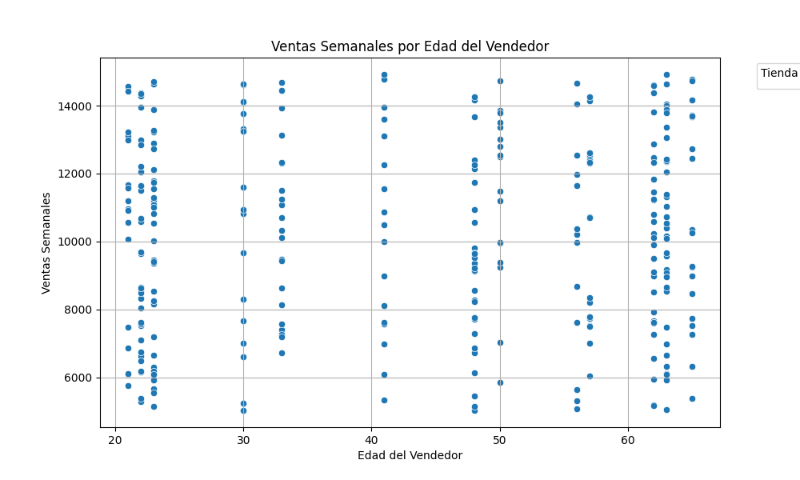

# Informe de Seguridad, Privacidad y Ética en el Sistema de Ventas

**Alumna:** Bihonda Epiquien Rodas  
**Curso:** Ética y Seguridad de los Datos  

## 1. Introducción
Este informe documenta las medidas de seguridad y privacidad implementadas en el sistema de ventas. El objetivo es garantizar la protección de los datos sensibles de los usuarios y asegurar el cumplimiento de las mejores prácticas de seguridad. Se busca minimizar los riesgos asociados al tratamiento de datos personales mientras se mantiene la utilidad del conjunto de datos para el análisis y la toma de decisiones.

## 2. Valor de los Datos en el Caso de Negocio
En este sistema de ventas, los datos generan valor al permitir la **toma de decisiones basada en hechos**, como la gestión eficiente de inventarios y el análisis de ventas. Para medir este valor objetivamente, se implementarán **KPIs (Indicadores Clave de Desempeño)** como:

- **Ventas semanales por sede**: Indicador que permite analizar el rendimiento de cada tienda.
- **Tasa de crecimiento mensual de ventas**: Mide el crecimiento en ventas mes a mes.
- **Satisfacción del cliente**: Medida indirecta basada en el rendimiento de los vendedores y la disponibilidad de productos.

## **3. Protección de Datos según Normativas Locales e Internacionales**

### **3.1 Ley Peruana de Protección de Datos Personales**
La **Ley N° 29733 (Ley de Protección de Datos Personales del Perú)** establece que los datos personales deben ser tratados de forma adecuada, asegurando la privacidad y los derechos de los usuarios. En el proyecto, los datos sensibles, como nombres de vendedores y ventas históricas, están protegidos mediante políticas de acceso controlado y encriptación, lo que asegura el cumplimiento de la ley.

### **3.2 Cumplimiento de Estándares Internacionales**
En el sistema, las prácticas se alinean con estándares como el **GDPR** (Reglamento General de Protección de Datos), que exige el consentimiento explícito de los usuarios y el derecho a acceder y eliminar sus datos personales.

## 4. Medidas de Seguridad y Protección de Datos

### 4.1 Autenticación de Dos Factores (2FA)
Para garantizar que solo usuarios autorizados accedan al sistema, se ha implementado un mecanismo de autenticación de dos factores (2FA). Este proceso asegura que, además de la contraseña, los usuarios deban verificar su identidad a través de un código temporal. Esta medida proporciona una capa de seguridad adicional, especialmente para usuarios con roles administrativos y de supervisión, reduciendo el riesgo de accesos no autorizados.

### 4.2 Encriptación y Hashing
Las contraseñas de los usuarios se protegen mediante **hashing** con el algoritmo bcrypt, una técnica que asegura que las contraseñas no puedan ser revertidas a su formato original. Esta protección es fundamental para garantizar la confidencialidad de las credenciales de acceso, incluso en caso de una brecha de seguridad en la base de datos.

### 4.3 Gestión de Accesos Basada en Roles
El sistema restringe el acceso a los datos en función del rol del usuario:
- **Vendedores:** Pueden agregar ventas para su tienda correspondiente.
- **Supervisores:** Tienen permisos adicionales para revisar los datos de ventas de su tienda.
- **Administradores:** Pueden acceder y gestionar los datos de todas las tiendas.  

Este control de acceso garantiza que cada usuario solo acceda a la información necesaria para cumplir con sus responsabilidades, minimizando el riesgo de exposición de datos.

## 5. Estrategias de Privacidad de los Datos

### 5.1 Consentimiento de Privacidad
Al acceder al sistema, los usuarios otorgan su consentimiento para el uso de sus datos personales exclusivamente para la gestión y análisis de ventas. Esta práctica asegura que los usuarios estén informados sobre el uso de su información.

### 5.2 Anonimización de Datos
Para proteger la identidad de los individuos en los análisis de ventas, los correos electrónicos y otros datos sensibles pueden ser **anonimizados**. Esto asegura que los datos personales no se expongan durante los procesos de análisis, protegiendo la privacidad de los usuarios.

### 5.3 Política de Privacidad
La política de privacidad del sistema informa a los usuarios sobre las prácticas de seguridad y sus derechos respecto a sus datos personales. Incluye información sobre los procesos de gestión del consentimiento, el acceso a sus datos y el derecho a la eliminación de la cuenta.

## **6. Consideraciones Éticas en el Proyecto**
### **7.1 Transparencia y Consentimiento
El proyecto asegura que los vendedores sean plenamente informados sobre cómo se utilizarán sus datos, garantizando que den su consentimiento explícito antes de que se utilicen para análisis comerciales. Esto es fundamental para cumplir con los principios de transparencia y respeto por la privacidad de los usuarios.

### **7.2 Sesgo Algorítmico**
Es necesario tener en cuenta los posibles sesgos algorítmicos que puedan surgir al analizar los datos de ventas. Estos sesgos podrían ser causados por la ubicación, el rol o incluso por la edad de los vendedores, lo que afectaría la equidad en los resultados obtenidos. Un análisis de sesgo en los datos es fundamental para garantizar que los resultados sean representativos y no favorezcan a ciertos grupos sobre otros.
#### **7.2.1 Distribución de Ventas por Ubicación de Tienda**
En el análisis de ventas por ubicación, se observa que algunas tiendas venden más que otras. Este tipo de sesgo geográfico es común en sistemas comerciales y podría deberse a factores externos como el tráfico de clientes, la ubicación de las tiendas o la demanda del mercado en esas áreas.

**Posibles razones:**

- Tiendas ubicadas en zonas comerciales de alto tráfico o en áreas con mayor poder adquisitivo pueden tener más ventas debido a la mayor afluencia de clientes.
- La competencia o popularidad de las marcas o productos puede ser diferente en cada región, lo que impacta directamente en las ventas.

#### **7.2.2 Distribución de Ventas por Rol (Supervisor vs Vendedor)**
En el análisis de ventas por rol, no se observan diferencias significativas entre las ventas de supervisores y vendedores. Ambos grupos parecen tener un rendimiento similar en términos de ventas semanales, lo que sugiere que el rol no influye significativamente en el desempeño de ventas.

**Posibles razones:**

- Los supervisores y los vendedores pueden tener roles complementarios que no afectan directamente las ventas, ya que ambos roles están orientados a la misma meta: incrementar las ventas.
- También es posible que las oportunidades de ventas sean similares para ambos roles, lo que resulta en un desempeño equivalente.

#### **7.2.3 Distribución de Ventas por Edad del Vendedor**
En el análisis de ventas por edad, no se encontró una correlación** significativa entre la edad del vendedor y las ventas semanales. Esto sugiere que no hay un sesgo de edad en el rendimiento de ventas, es decir, los vendedores de todas las edades parecen tener un desempeño similar.

**Posibles razones:**

- La habilidad de ventas y el desempeño frente al clientes pueden ser más determinantes que la edad del vendedor.
- El sistema de ventas puede estar estructurado de tal manera que no favorezca a los vendedores más jóvenes o más experimentados.

### **7.3 Reflexión sobre el Uso de la Privacidad Diferencial**
El uso de privacidad diferencial en este proyecto es una estrategia ética para proteger la identidad de los vendedores mientras se obtiene información útil para la toma de decisiones. La privacidad diferencial asegura que se pueda analizar el comportamiento comercial sin comprometer la privacidad individual. No obstante, la implementación de ε (epsilon) debe ser cuidadosamente ajustada para balancear precisión y privacidad sin sacrificar la utilidad de los datos.

## **7. Plan de Respuesta ante Incidentes de Seguridad**

### **7.1 Plan Básico de Respuesta ante Fuga o Pérdida de Datos**
En caso de una brecha de seguridad, el sistema cuenta con un **plan de respuesta ante incidentes** que incluye:

1. **Detección rápida del incidente**: Utilizando los registros de auditoría y monitoreo en tiempo real.
2. **Aislamiento del sistema**: En caso de detección de una fuga, se desconectarán los servidores comprometidos para evitar mayores filtraciones.
3. **Recuperación y respaldo de datos**: Se implementarán **backups** periódicos y procedimientos de **recuperación ante desastres**, asegurando que los datos puedan ser restaurados rápidamente en caso de un ataque.

### **7.2 Notificación de Incidentes**
En cumplimiento con las leyes de protección de datos (como el GDPR), cualquier fuga significativa de datos personales deberá ser reportada a las autoridades competentes y a los usuarios afectados en un plazo de 72 horas.

## 8. Recomendaciones para Fortalecer la Seguridad

### 8.1 Encriptación de Datos Sensibles
En futuras fases, se recomienda aplicar encriptación avanzada (por ejemplo, AES) para todos los datos sensibles en reposo y en tránsito, asegurando que cualquier información comprometida se mantenga inaccesible para usuarios no autorizados.

### 8.2 Auditoría de Actividades
Implementar registros de auditoría detallados para monitorear las actividades de los usuarios en el sistema permitiría detectar comportamientos inusuales y prevenir posibles accesos indebidos a la información.

### 8.3 Concientización sobre Seguridad
Se recomienda un programa de capacitación para los usuarios con acceso al sistema, donde se refuercen prácticas de seguridad, como el uso de contraseñas fuertes y la identificación de intentos de phishing.

## 9. Conclusión
En esta fase del sistema de ventas, se han implementado medidas clave para garantizar la seguridad y privacidad de los datos, incluyendo la autenticación de dos factores y el control de acceso basado en roles. Estas prácticas fortalecen la protección de la información, asegurando un entorno seguro para la gestión de ventas y cumpliendo con las mejores prácticas de seguridad de datos.
